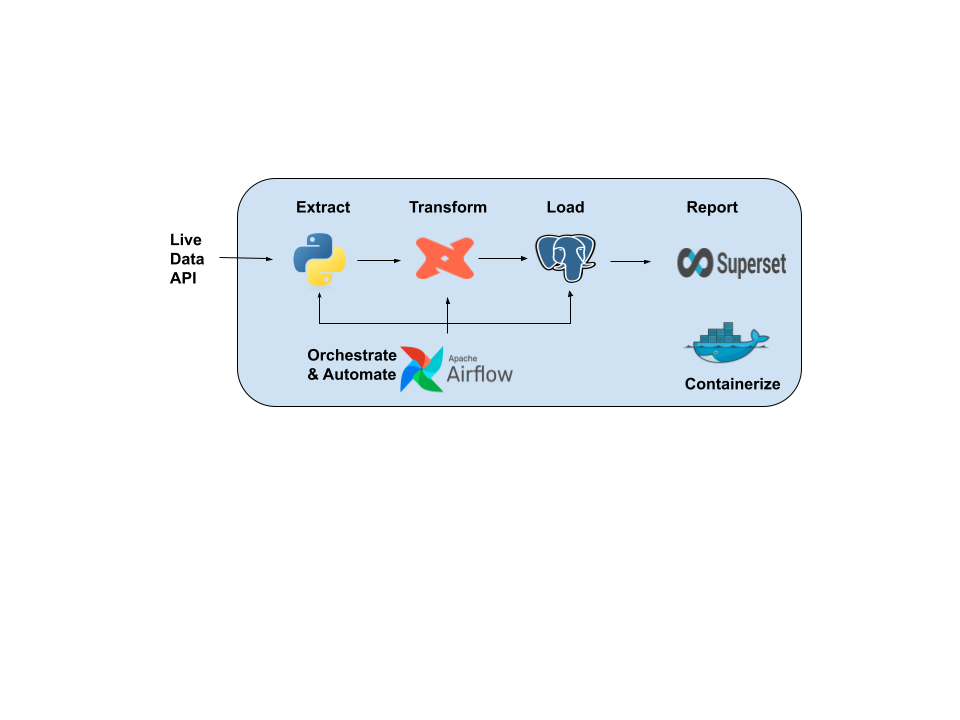
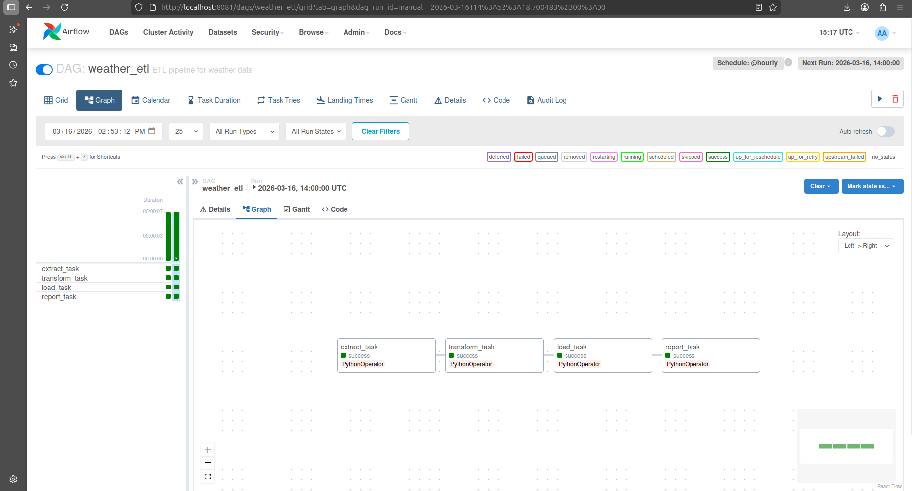
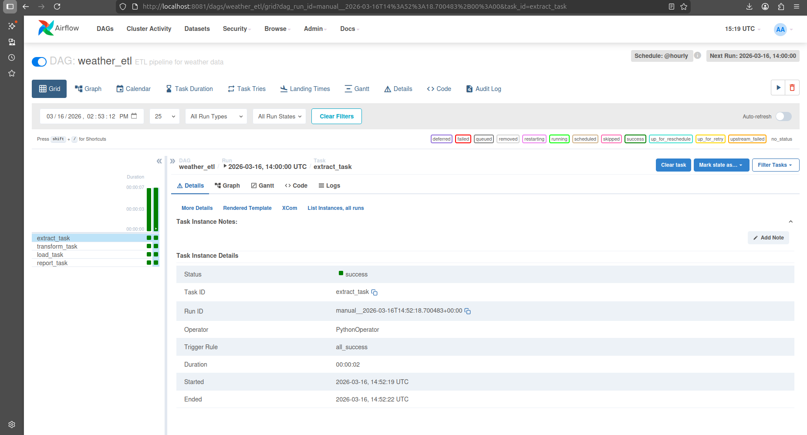
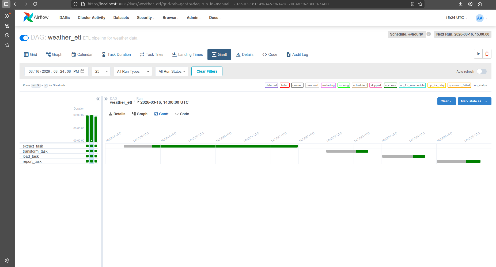
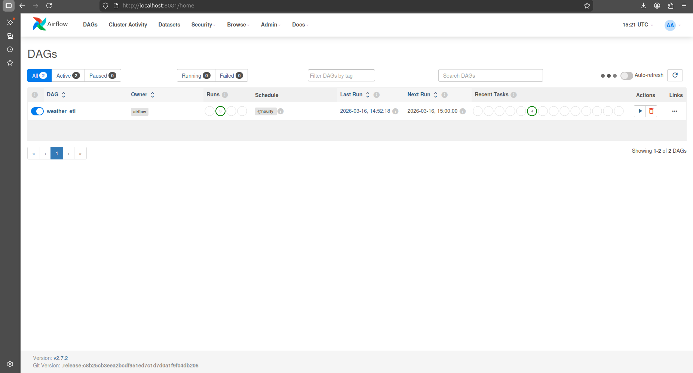

# OpenWeatherAPI Data Engineering Pipeline

## Overview
This project demonstrates an end-to-end data engineering pipeline that ingests weather data from the OpenWeather API, processes it, stores it in PostgreSQL, transforms it using dbt, and visualizes insights using Apache Superset.

The pipeline is orchestrated with Apache Airflow and containerized using Docker to simulate a production-like data platform.

## Architecture

1. Extract
   Weather data is fetched from the OpenWeather API using Python.

2. Raw Data Storage
   The raw API response is saved as JSON for traceability and debugging.

3. Transform
   Raw weather data is cleaned, parsed, and structured into a tabular format.

5. Data Validation
   The transformed dataset is validated to ensure data quality before loading.

6. Load
   The processed data is stored in a PostgreSQL database.

7. Metrics Logging
   ETL run metrics (status, records processed, runtime, errors) are recorded in PostgreSQL.

8. Orchestration
   The ETL pipeline is orchestrated using Apache Airflow, with tasks for extract, transform, load, and reporting.

   ## ETL Pipeline with Apache Airflow

    The ETL pipeline orchestrates the extraction, transformation, and loading of weather data:

    1. Extract weather data from OpenWeather API
    2. Transform and clean the data
    3. Load data into PostgreSQL
    4. Log metrics for each step
    5. Generate PDF reports

    # Airflow DAG Overview

    

    This image shows the DAG structure with separate tasks for extract, transform, load, and report generation.

    # Airflow Task Logs

    

    # Airflow Gantt

    

    # Airflow Runs

    

    Here we can see the tasks running successfully and metrics being logged.

9. Data Modeling
   dbt is used to model and transform the stored data for analytics.

10. Visualization
    Apache Superset connects to PostgreSQL to create dashboards and visualize insights.

11. Containerization
    All services (Airflow, PostgreSQL, Superset, dbt) run inside Docker containers.

## Features

- **Python ETL Pipeline** – Extracts weather data from the OpenWeather API and processes it through a structured pipeline.
- **Data Validation** – Ensures data quality with validation checks for temperature, humidity, wind speed, and coordinates.
- **PostgreSQL Storage** – Stores processed weather data and pipeline metrics in a PostgreSQL database.
- **Apache Airflow Orchestration** – Automates and schedules the ETL pipeline using Airflow DAGs.
- **dbt Transformations** – Performs analytical transformations on the processed data.
- **Apache Superset Dashboards** – Visualizes weather analytics through interactive dashboards.
- **Docker Containers** – Containerized environment for Airflow, PostgreSQL, and Superset services.
- **Pipeline Metrics Logging** – Tracks pipeline execution metrics and validation results.
- **Automated PDF & CSV Reports** – Generates reports from processed weather data.
- **Architecture Diagram** – Illustrates the full data pipeline architecture.
- **Pipeline Screenshots** – Includes Airflow DAG execution and PostgreSQL metrics.
- **Git Version Control** – Managed using Git for version tracking and collaboration.

## Tech Stack

- Python
- Apache Airflow
- PostgreSQL
- dbt
- Apache Superset
- Docker
- Pandas
- FPDF
- Git

## Pipeline Flow

1. Extract weather data using Python from OpenWeather API
2. Load raw data into PostgreSQL
3. Transform and model data using dbt
4. Orchestrate the pipeline using Airflow
5. Visualize data using Superset dashboards

## Project Structure
OpenWeatherAPI/
dags/                         # Apache Airflow DAGs for orchestration
logs/                         # Airflow logs and pipline logs
openweather_dbt/              # dbt project (models, tests, transformations)
OpenWeatherAPI/               #Modules(ingestion, processing, report, storage, logs config file, and main file)                
plugins/                      # Airflow custom plugins
screenshots/
ETL/                          # Code or terminal screenshots
dbt/                          # Models, tests, terminal output
PostgreSQL/                   # pgAdmin / query output
Superset/                     # Charts and dashboards
superset/                     # Apache Superset Docker configuration
venv/                         # Python virtual environment

docker-compose.yml            # Docker services configuration
openweatherapi_architecture.png # Pipeline architecture diagram
requirements.txt              # Python dependencies
README.md                     # Project documentation

## Environment Variables

Create a .env file with:

WEATHER_API_KEY=your_api_key
DB_NAME=airflow
DB_HOST=localhost
DB_USER=airflow
DB_PASSWORD=airflow
DB_PORT=5432

## How to run the project

1. Clone the repo
git clone git clone https://github.com/mnelisim/OpenWeatherAPI.git
cd OpenWeatherAPI
2. Create a virtual environment
python3 -m venv venv
source venv/bin/activate
3. Install dependencies
pip install -r requirements.txt
4. Start services using Docker
docker-compose up -d
5. cd superset
docker-compose -f docker-compose-image-tag.yml up -d
cd .. (to go back to OpenWeatherAPI)
6. Run dbt models
cd ../openweather_dbt
dbt run
dbt test
7. Access Superset (open your browser)
http://localhost:8088

## Author

Mnelisi Masilela
BSc IT Graduate | Data Engineering Portfolio Project
